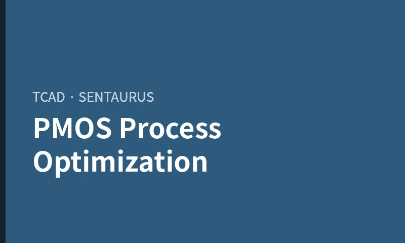
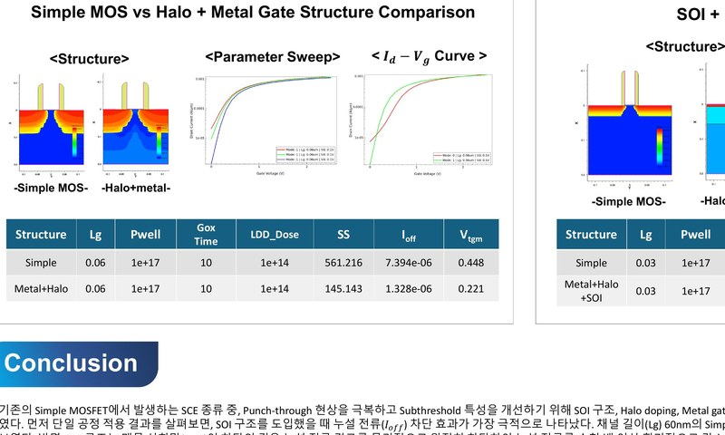
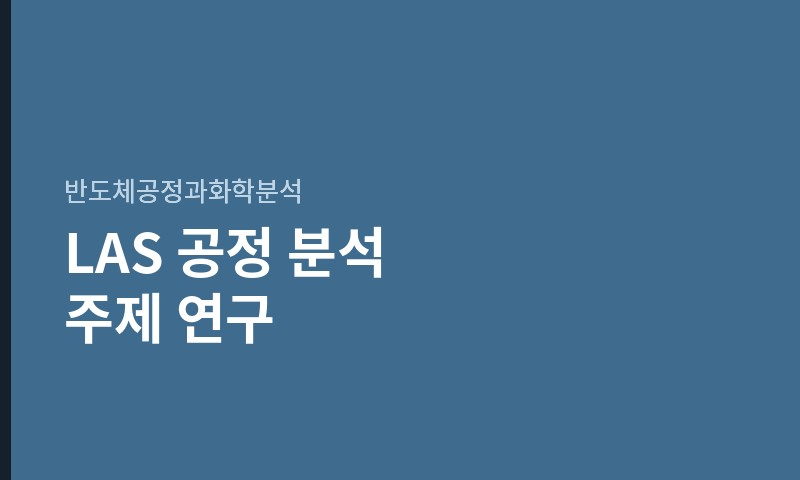
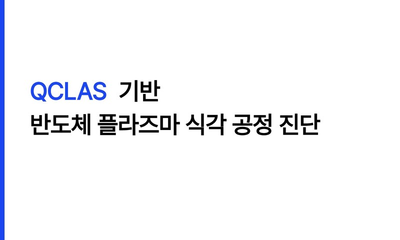
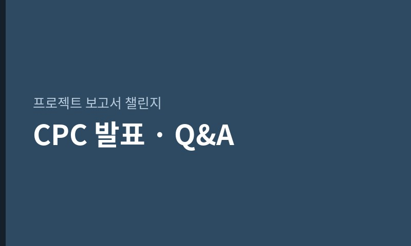
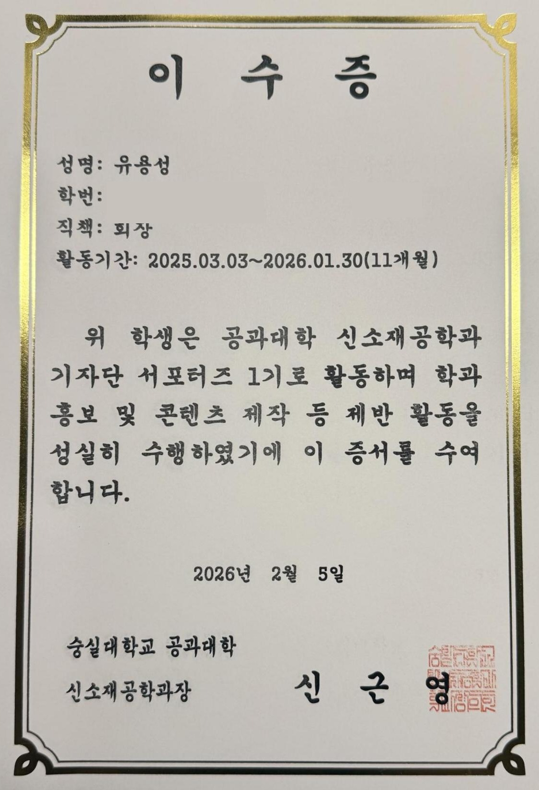

# 유용성 (Yongseong Ryu) | Materials & Semiconductor Engineering Portfolio

반도체 공정 분야로의 취업을 목표로 하는 숭실대학교 신소재공학과 학생입니다. 꾸준함을 강점으로 삼아 학기를 거듭할수록 성적이 우상향해왔으며, TCAD 시뮬레이션을 중심으로 공정 설계와 소자 특성 분석 역량을 쌓아가고 있습니다.

**Contact:** ryu990530@gmail.com · [github.com/ryu980920](https://github.com/ryu980920)

---

## Portfolio Summary

| No. | Item | Period | Type | Link |
| --- | --- | --- | --- | --- |
| 1 | QCLAS 기반 반도체 플라즈마 식각 공정 진단 | 2026.07 | Conference Talk | [Presentation Page](qclas/) |
| 2 | TCAD PMOS Process Conversion & Optimization | 2026.04–2026.05 | Project | [Project Page](tcad/) |
| 3 | 30/60nm NMOS Short Channel Effect 개선 (Team) | 2026.05–2026.06 | Team Project | [Project Page](sce/) |
| 4 | LAS 기반 반도체 공정 분석 주제 연구 (Team) | 2026.05-2026.06 | Team Project | [Project Page](las/) |
| 5 | 웨어러블 헬스케어용 초저전력 SoC — 기업별 기술 비교 (Team) | 2026.04–2026.06 | Team Project | [Project Page](soc/) |

---

## Education

**숭실대학교 (Soongsil University)**
신소재공학과 학사과정 (B.S. Student in Materials Science and Engineering)
차세대반도체공학과 복수전공 (Double Major in Next-Generation Semiconductor Engineering)

---

## Skills & Interests

- **Semiconductor Devices & Processes**
- **TCAD Device/Process Simulation** — Synopsys Sentaurus (Workbench, SProcess, SDevice, SVisual). 개인 프로젝트, 팀 프로젝트, 학회 발표를 통해 공정 최적화부터 공정 진단까지 다각도로 시뮬레이션 경험을 쌓음
- **Materials Characterization** — XRR, XRD, EPR 등 분석 장비 원리 및 활용 (반도체공정·화학분석 수업)
- **Materials Science** — 재료결정학, 무기화학, 고분자공학 등 전공 지식
- **Technical Presentation & Q&A** — 반도체공학회 하계학술대회 구두 발표를 비롯해 팀 프로젝트 대표 발표(반도체공정과화학분석·반도체개발프로세스), CPC 프로젝트 발표 등 다수의 발표를 수행. 발표 후 질의응답에서 대부분의 질문에 데이터와 근거를 들어 직접 답변한 경험
- **Collaboration & Leadership** — 다수의 팀 프로젝트를 수행했으며, LAS 프로젝트에서는 조장으로서 일정·역할 배분을 조율하고 팀을 대표해 발표를 담당

---

## Projects

대표 프로젝트입니다. QCLAS 학회 발표와 이전·이후 학기 프로젝트를 포함한 전체 목록은 **[전체 프로젝트 보기 →](projects/)** 에서 학기별로 확인할 수 있습니다.

<a class="card" href="tcad/">

COMPLETED개인 프로젝트

2026.04 — 2026.05 · 반도체집적공정

TCAD PMOS Process Conversion &amp; Optimization

누설 전류 약 91%↓ · SS 개선

</a>
<a class="card" href="sce/">

COMPLETED팀 프로젝트 · 5인

2026.05 — 2026.06 · 반도체집적공정

30/60nm NMOS Short Channel Effect 개선

SS 186.6 → 89.9 mV/dec · CPC 발표

</a>
<a class="card" href="las/">

COMPLETED팀 프로젝트

2026.05 — 2026.06 · 반도체공정과화학분석

LAS 기반 반도체 공정 분석 주제 연구

조장 · 반도체공학회 발표로 연계

</a>

**[▶ 전체 프로젝트 보기 (학기별 정리) →](projects/)**

---

## Presentations & Competitions

<a class="card" href="qclas/">

CONFERENCE TALK

2026.07 · 반도체공학회 하계학술대회

QCLAS 기반 반도체 플라즈마 식각 공정 진단

특별세션 구두 발표 · 첫 공식 학술 발표

</a>
<a class="card" href="sce/#cpc-발표-및-피드백-qa">

COMPETITION

2026.06 · 프로젝트 보고서 챌린지

CPC — SCE 프로젝트 결과 발표

Q&amp;A 2건 직접 대응 · High-k 필요성 도출

</a>

---

## Activities

### 신소재공학과 기자단 서포터즈 1기 — 단원 (2025.03–2026.01)

학과 홍보 콘텐츠를 기획·제작하는 [기자단 서포터즈](https://www.instagram.com/ssu_mpick/?hl=ko) 1기 단원으로 활동했습니다. 단원별로 콘텐츠를 분담해 **기획·촬영·편집을 한 사람이 처음부터 끝까지 전담**하는 방식으로 운영되어, 아래 콘텐츠는 모두 직접 단독으로 제작해 학과 공식 인스타그램에 게시한 결과물입니다.

- [신입생 대상 2026 회장단 인터뷰 카드뉴스](https://www.instagram.com/p/DTCVBE_EmY9/) (2026.01) — 신입생이 궁금해할 내용을 회장단에게 인터뷰해 카드뉴스로 제작
- [학과 특별강좌 취재 릴스](https://www.instagram.com/reel/DQnYbEskoec/) (2025.11) — 특강 주제를 요약하고 수강생 인터뷰를 편집해 릴스로 제작
- [학과장 교수님 인터뷰 카드뉴스](https://www.instagram.com/p/DKaxCf1y06p/) (2025.06) — 신입생이 학과장님을 편하게 느끼도록 전공·일상 질문을 섞어 인터뷰

특히 창설 첫 기수였던 만큼 조직이 단순 소모임으로 남을지 독립된 기자단으로 자리잡을지에 대한 논의가 있었는데, 단원들과 함께 의견을 모아 독립 기자단으로 정착하는 방향을 이끌어냈습니다.

▲ 기자단 서포터즈 1기 이수증 (클릭하면 크게 볼 수 있습니다)

### 신소재공학과 학생회 — 복지국원 (2026.03–2026.12)

학생 사물함 배정·철거, 간식 행사, 물품 대여 등 학과 구성원을 위한 복지사업을 기획·운영했습니다.

### 슈런 (교내 러닝 동아리) — 부원(2025.03-2025.12), 훈련부 임원 (2026.03–2026.12)

정기 러닝에서 선두 페이서를 맡아 그룹의 페이스를 조율하고, 운동 종료 후 쿨다운 스트레칭을 진행했습니다. → [슈런 인스타그램](https://www.instagram.com/ssurun_2016/?hl=ko)

---

## Coursework

반도체 공정·소자 및 재료 분야와 관련해 수강한 전공 과목입니다.

**반도체 · 소자:** 반도체집적공정 · 반도체공정과화학분석 · 반도체개발프로세스 · 고체물리

**재료:** 재료결정학 · 무기화학 · 고분자공학
