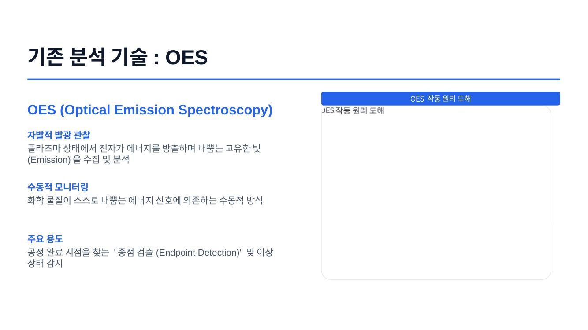
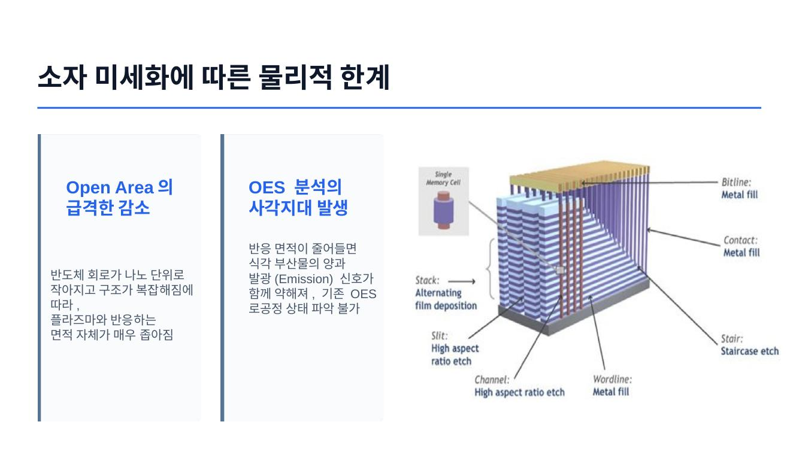
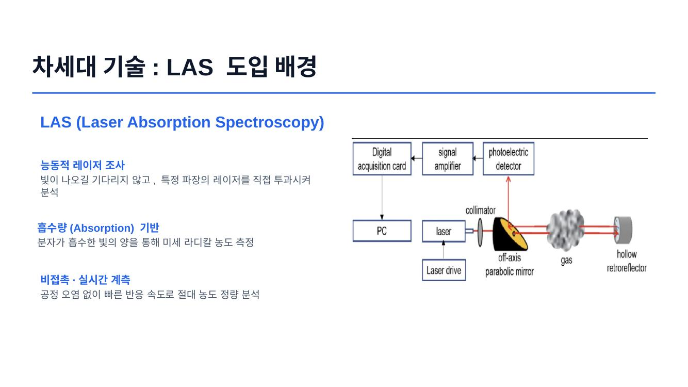

# LAS 기반 반도체 공정 분석 주제 연구 — 팀 프로젝트

**Course:** 반도체 공정과 화학분석 (팀 프로젝트, 7조)
**Period:** 2026.05-2026.06
**Role:** 주제 선정 발표 담당 (팀 대표 발표)
**Keywords:** LAS, QCLAS, OES, Plasma Etching, 문헌 기반 조사, 피드백 반영

[← 포트폴리오 홈으로](../)

> 이 프로젝트에서 선정·연구한 주제를 이후 **반도체공학회 하계학술대회**에서도 발표했습니다. 기술 원리(OES 한계 → LAS/QCLAS → CF₂·SiF₄ 사례)의 상세 설명은 학회 발표 페이지에 정리되어 있습니다. → [QCLAS 학회 발표 페이지 보기](../qclas/)
>
> 본 페이지는 기술 내용의 반복 대신, **팀 프로젝트가 어떤 과정으로 진행되었고 피드백을 어떻게 반영했는지**를 중심으로 정리합니다.

---

## 1. 프로젝트 개요와 역할

반도체 공정과 화학분석 수업의 팀 프로젝트로, 미세화된 반도체 식각 공정을 분석할 차세대 진단 기법을 조사·발표했다. 최종 선정 주제는 **"Laser Absorption Spectroscopy(LAS)를 이용한 반도체 Plasma 공정 분석"** 이다.

팀 내에서 **주제 선정 발표(팀 대표 발표)** 를 담당했다. 왜 이 주제를 골랐는지, 앞으로 어떤 방향으로 탐구할지를 팀을 대표해 발표하는 역할이었다.

---

## 2. 주제 선정 배경 (요약)

미세화로 식각 부산물이 줄면서 기존 광학 진단법 **OES**는 방출광 자체가 약해져 정밀 분석에 한계가 생겼다. 이를 보완할 방법으로, 외부 레이저를 쏘아 흡수량으로 농도를 정량하는 **LAS**, 그중에서도 중적외선을 쓰는 **QCLAS**를 주제로 선정했다.

<!-- 주제 선정 발표에 사용한 슬라이드 -->

> 기술 원리에 대한 자세한 설명(QCLAS 분석 과정 5단계, CF₂/SiF₄ 모니터링 사례, 정량 데이터 근거 등)은 [QCLAS 학회 발표 페이지](../qclas/)에 정리되어 있다.

---

## 3. 연구 과정 & 피드백 반영 (핵심)

이 프로젝트의 핵심은 **주제 선정 발표에서 받은 피드백을 근거의 재정비로 연결한 과정**이다.

| 단계 | 내용 | 결과 |
|---|---|---|
| ① 주제 선정 발표 | OES의 한계와 LAS/QCLAS의 필요성을 팀 대표로 발표 | 교수님으로부터 **"근거로 사용한 논문이 너무 오래되었다"** 는 피드백 |
| ② 피드백 반영 재조사 | 근거 문헌을 **2024~2026년 사이 최신 논문으로 한정**하여 자료를 다시 조사 | 최신 공정 트렌드에 부합하는 근거로 논지 재구성 |
| ③ 최종 발표 | 갱신된 근거를 바탕으로 최종 발표 진행 | 근거의 시의성·신뢰성이 크게 향상 |

**피드백의 핵심을 놓치지 않았다는 점**이 중요하다. "논문이 오래됐다"는 지적은 단순히 출처 연도의 문제가 아니라, 빠르게 변하는 반도체 공정 분야에서 오래된 근거는 현재 트렌드를 반영하지 못한다는 뜻이다. 그래서 단순히 논문 몇 개를 교체한 것이 아니라, **인용 문헌 전체를 2024~2026년 범위로 제한**하는 원칙을 세워 자료조사를 다시 수행했다.

---

## 4. 배운 점 (Retrospective)

- **근거의 시의성**: 기술 분야에서는 "무엇을 주장하느냐"만큼 "얼마나 최신 근거로 뒷받침하느냐"가 설득력을 좌우한다. 최신 문헌으로 근거를 재정비하며 이 점을 체감했다.
- **피드백을 원칙으로 전환**: 지적을 개별 수정으로 끝내지 않고 "2024~2026년 문헌만 사용"이라는 명시적 기준으로 바꿔, 이후 조사 전체의 일관성을 확보했다.
- **팀 대표 발표 경험**: 팀의 방향성을 대표해 발표하는 역할을 맡으며, 조사 내용을 청중이 이해할 수 있는 논리로 재구성하는 연습이 되었다. 이 경험은 이후 반도체공학회 발표로 이어졌다.
