# QCLAS 기반 반도체 플라즈마 식각 공정 진단

**Conference:** 2026년도 반도체공학회 하계종합학술대회 (2026 Summer Annual Conference of ISE)
**Host:** 반도체공학회 (The Institute of Semiconductor Engineers, ISE)
**Session:** 특별세션 — 숭실대학교 차세대반도체학과 1 (좌장: 문지욱, 김성식)
**When / Where:** 2026.07.15 (수) 16:00–17:30 · 아난티 앳 부산코브, G층 크루즈 그랜드 볼룸 A
**Format:** 구두 발표 (Oral Presentation) 후 질의응답
**Presenter:** 유용성 (숭실대학교 신소재공학과)

[← 포트폴리오 홈으로](../)

---

## 발표 개요

반도체 미세화로 식각 부산물이 줄면서 기존 광학 진단법(OES)의 신뢰성이 한계에 부딪히고 있습니다. 본 발표에서는 그 대안으로 **QCLAS(Quantum Cascade Laser Absorption Spectroscopy, 양자 캐스케이드 레이저 흡수 분광법)** 를 소개하고, 실시간·정량적 식각 공정 진단이 어떻게 가능한지를 원리와 실제 측정 데이터를 근거로 설명했습니다. 국내 반도체공학회 하계학술대회 특별세션에서 구두로 발표한 첫 공식 학술 발표입니다.

---

## 1. 배경 — 왜 새로운 식각 진단이 필요한가

### 미세화에 따른 식각 부산물 감소

반도체가 미세화되면서 패턴 없이 노출된 면적(open area)이 감소하고 있습니다. 3D NAND는 셀 적층 수 증가로, 논리 소자는 GAA 같은 구조 도입으로 미세 패턴이 늘면서, 동일 면적 대비 식각 부산물의 절대량이 줄어듭니다.

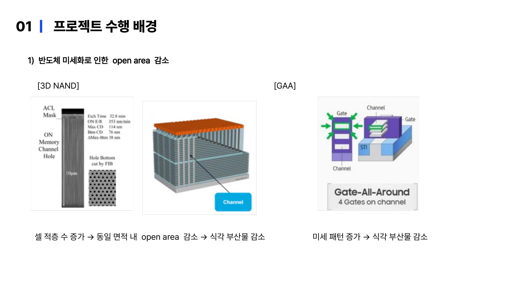

### 기존 분석법 OES의 한계

OES(Optical Emission Spectroscopy)는 플라즈마 내 원자·분자가 들뜬 상태에서 바닥 상태로 돌아올 때 방출하는 빛을 분석합니다. 그러나 (1) 식각 부산물 감소로 방출광 자체가 약해지고, (2) 동일한 플라즈마 조성에서도 Viewport(투시창) 오염 수준에 따라 신호가 불규칙하게 변해, 정량 분석의 신뢰성이 떨어집니다.

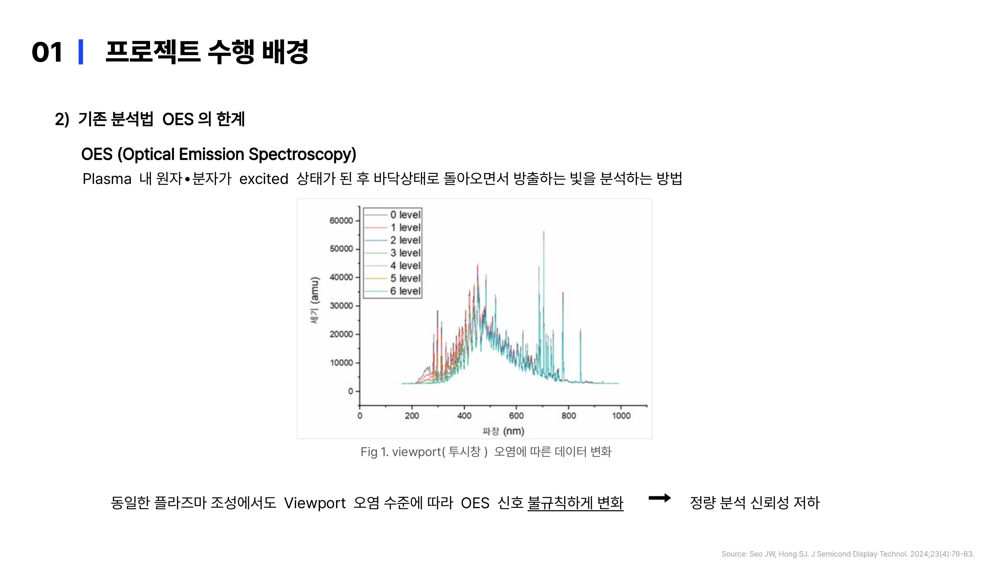

### 대안: QCLAS

QCLAS는 중적외선(Mid-IR) 영역의 빛을 방출하는 양자 캐스케이드 레이저를 이용한 흡수 분광법입니다. High Aspect Ratio(고종횡비) 식각에서 식각종 CF₂를 모니터링해 테이퍼링·보잉 같은 결함을, 식각 부산물 SiF₄의 분압을 측정해 식각 종료 시점(Endpoint Detection, EPD)을 알아낼 수 있습니다.

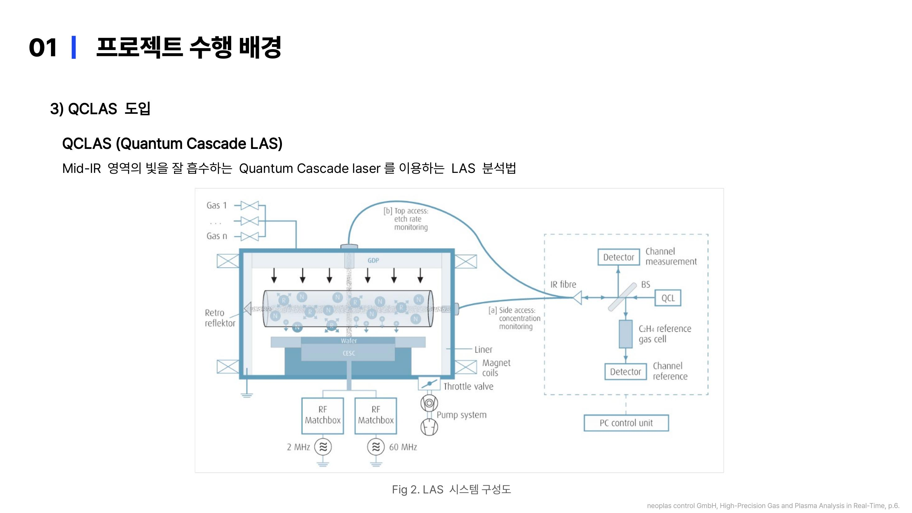

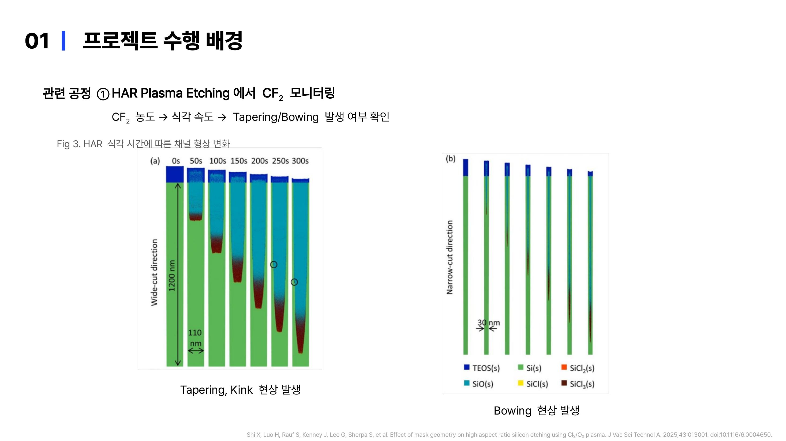

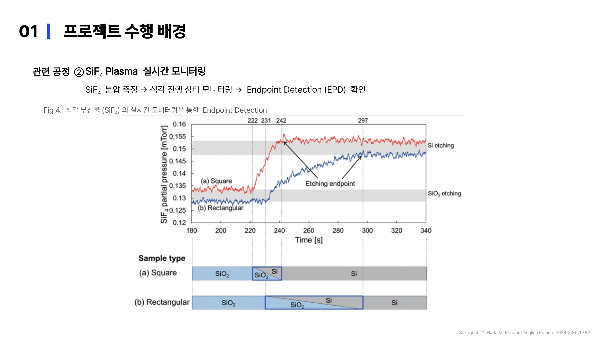

관련 소자로 3D NAND(채널 홀 형성을 위한 HAR 식각)와 GAA(나노시트 형성을 위한 고정밀 식각)가 있습니다.

---

## 2. QCLAS 분석 원리

분석 과정은 크게 다섯 단계입니다.

1. **광원 발생** — QCL에서 측정 화학종이 흡수하는 파장의 중적외선 단일 파장 레이저 생성
2. **레이저 스플리팅** — 빔 스플리터로 측정 경로와 기준 경로 분리
3. **기준 신호 확보** — 기준 셀의 기준 가스 흡수 신호로 파장 보정·주파수 고정
4. **광 흡수 측정** — 챔버 내부에서 화학종에 흡수되고 남은 빛을 Retro-reflector로 반사시켜 검출, 흡수량을 Beer–Lambert 식으로 계산
5. **신호 처리·정량 분석** — 기준 신호로 노이즈를 제거하고 실시간 농도 계산 (PC control unit)

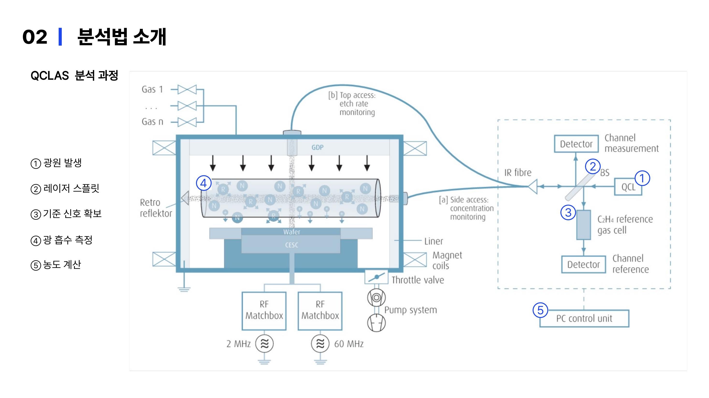

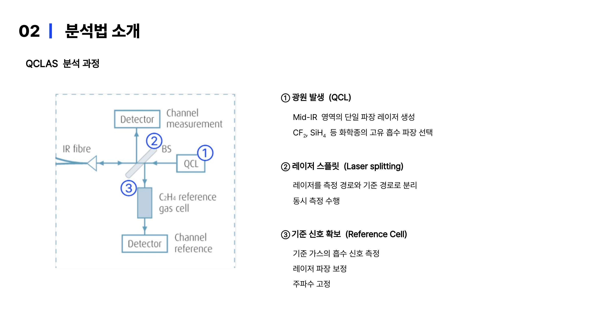

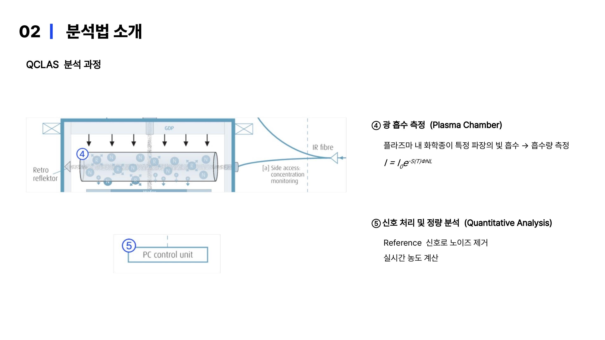

실제 측정 셋업은 QCL Laser Head, 기준 가스가 담긴 Gas Cell Module, 투과 레이저를 검출하는 Detector로 구성됩니다.

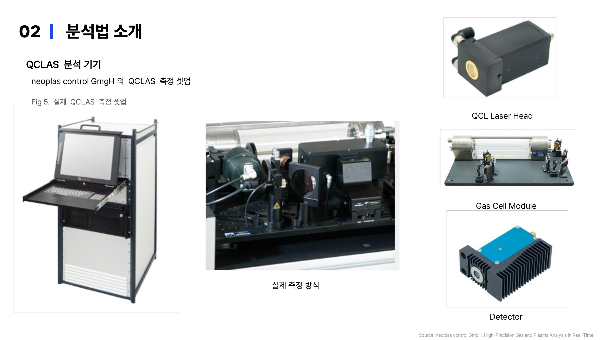

QCLAS로 얻는 데이터는 두 종류입니다. 흡수 스펙트럼으로 **어떤 화학종이 있는지(정성)** 를, 화학종의 농도·분압으로 **공정 상태와 종료 시점(정량)** 을 실시간 진단할 수 있습니다.

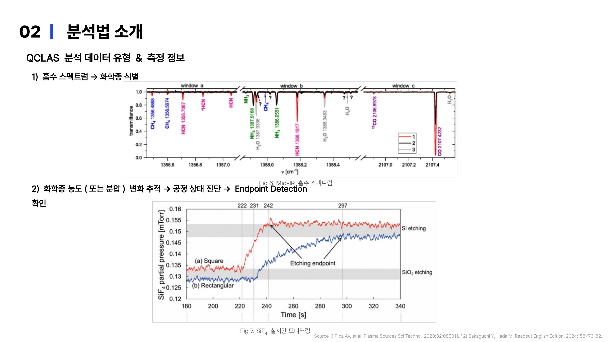

---

## 3. 데이터 해석 — QCLAS의 정량성 근거

### 근거 1. SiF₄ 분압과 식각 속도의 강한 선형성 (Sakaguchi & Hada, 2024)

ICP 식각 장비로 SiO₂ 식각 시 발생하는 SiF₄를 측정한 결과, 바이어스 전력을 30 W → 180 W로 올릴수록 SiF₄ 분압이 증가했습니다. SiF₄ 분압과 SiO₂ 식각 속도의 **상관계수가 0.99**로 거의 완벽한 선형 관계를 보여, 분압 측정만으로 식각 속도를 실시간 예측할 수 있음을 입증합니다.

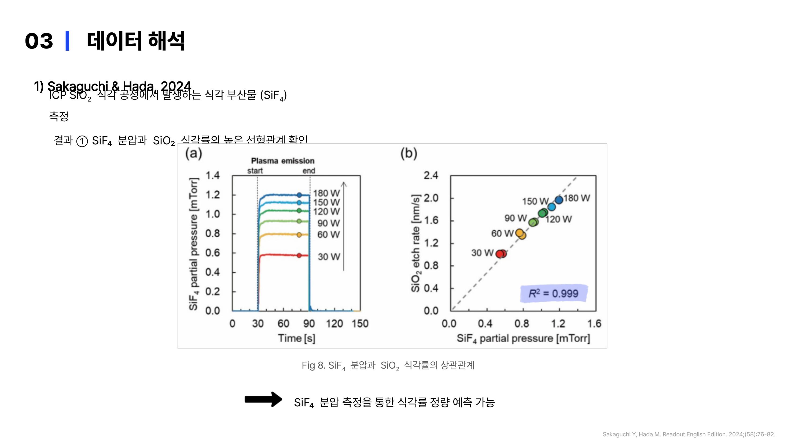

또한 SiO₂ 아래 실리콘 층이 노출되면 부산물 분압이 급증하는 변곡점이 나타나, 이를 통해 정확한 Endpoint Detection이 가능합니다.

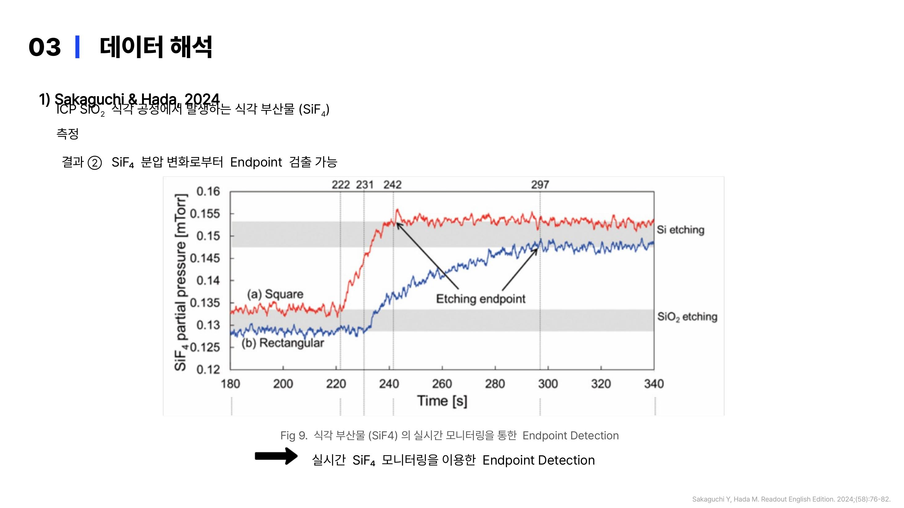

### 근거 2. Low Open Area 공정에서도 유효 (Lee et al., 2025)

Open area가 작은 유전체 식각 공정에서도 QCLAS 신호로 Endpoint 지연 검출이 가능했고(Fig 10), TEM 단면 결과와 일치했으며(Fig 11), SiN 두께 변화 및 산화막 과식각(Over-Etch)까지 정량적으로 상관관계가 확인되었습니다.

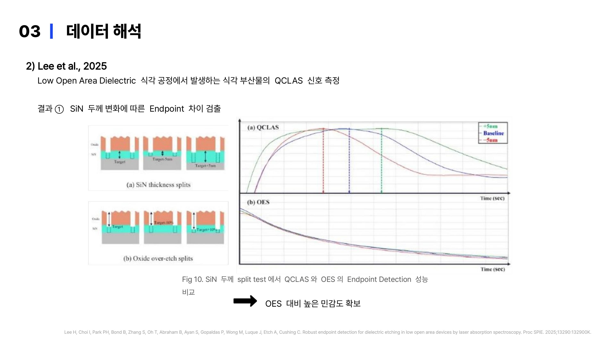

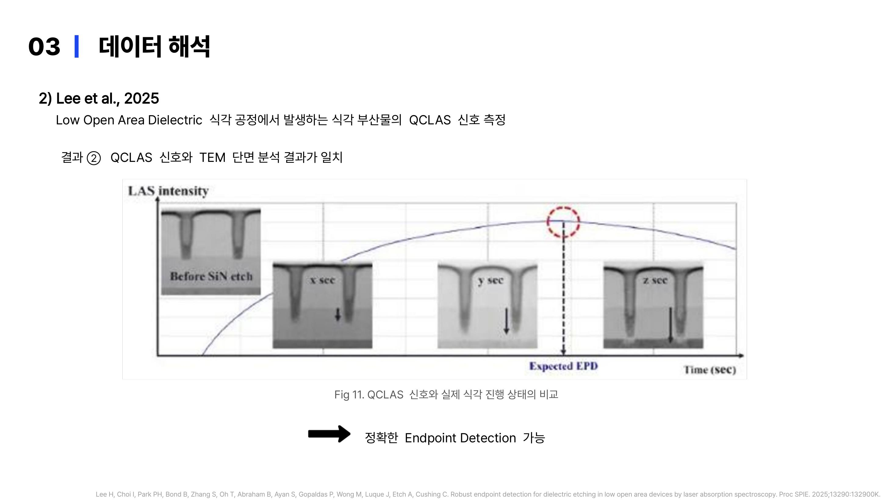

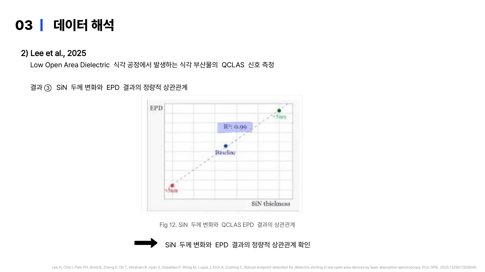

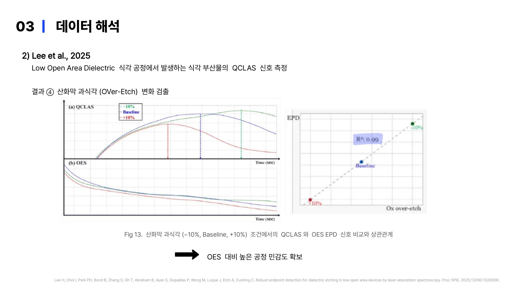

---

## 4. 요약 및 전망

QCLAS는 실시간 정량 분석과 고감도·고선택성 모니터링이 가능하다는 강점이 있으나, 공간 분해능 부족·단일 화학종 중심·산업 적용 범위 제한이라는 한계도 명확합니다. 이를 극복할 방향은 다음과 같습니다.

| QCLAS 특징 | 현재 한계 | 향후 전망 |
|---|---|---|
| 실시간 정량 분석 | 공간 분해능 부족 | **Hybrid Metrology** — 간섭계·반사계와 융합해 Per-die 위치 정보 확보 |
| 고감도 공정 모니터링 | 단일 화학종 중심 분석 | **Multi-species Monitoring** — Dual-Comb 기술로 여러 종 동시 측정 |
| OES 대비 정량·고선택성 | OES 대비 산업 적용 범위 제한 | **산업 표준화 확대** — EUV·ALE 등 차세대 공정 적용 |

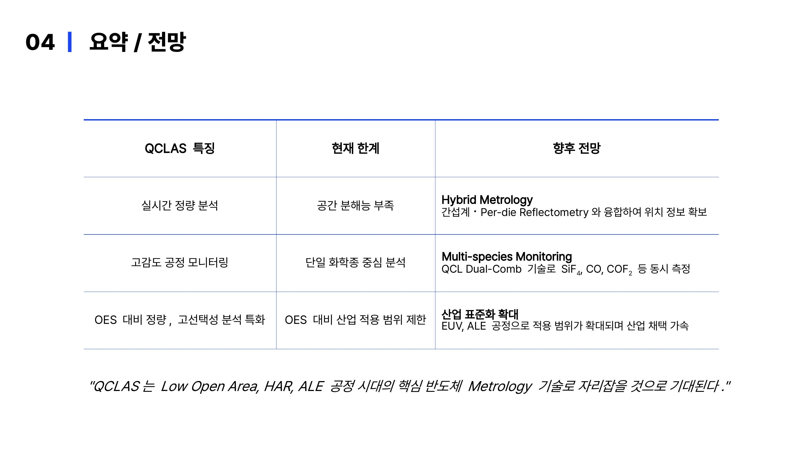

결론적으로 QCLAS는 Low Open Area, HAR, ALE 공정 시대의 핵심 반도체 Metrology 기술로 자리 잡을 것으로 기대합니다.

---

## 질의응답 (Q&A)

**Q. OES 대비 QCLAS가 갖는 장점은 무엇인가?**

데이터 해석 파트를 근거로 답변했습니다. OES는 방출광의 세기에 의존해 정성적 경향 파악에 그치고 Viewport 오염에 취약한 반면, QCLAS는 흡수량을 Beer–Lambert 식으로 환산하는 **정량 분석**이 가능하며, SiF₄ 분압과 식각 속도의 상관계수가 0.99에 이를 만큼 신뢰도 높은 정량성과 고선택성을 갖는다는 점을 근거로 제시했습니다.

---

## 발표를 마치며

처음으로 학회라는 공식적인 자리에 서서 발표하며 자신감을 얻었고, 들어온 질문에도 발표 중 다뤘던 데이터를 근거로 답변할 수 있었습니다. 다만 답변을 더 매끄럽게 전달하지 못한 점은 아쉬움으로 남아, 이후 발표에서 개선하고자 하는 지점입니다.

---

## 발표 슬라이드 전체

아래는 발표에 사용한 전체 슬라이드입니다.

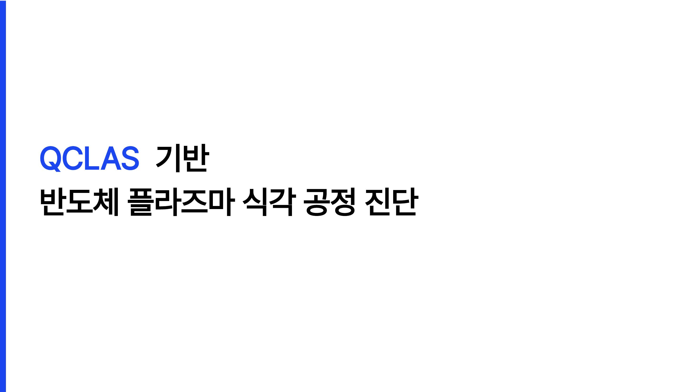
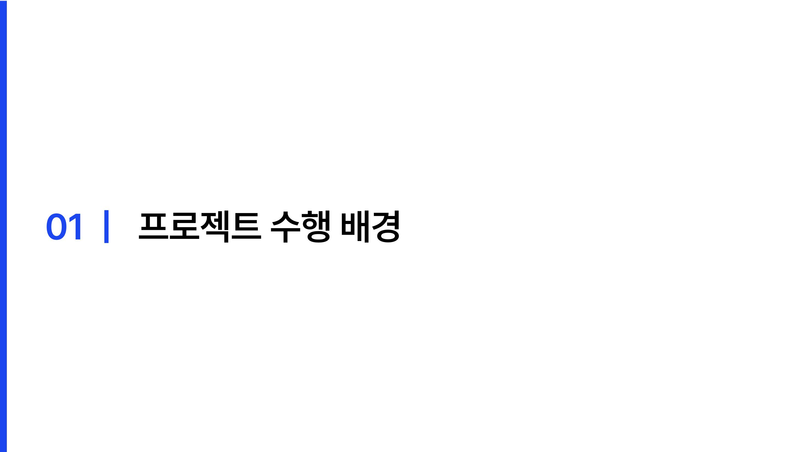

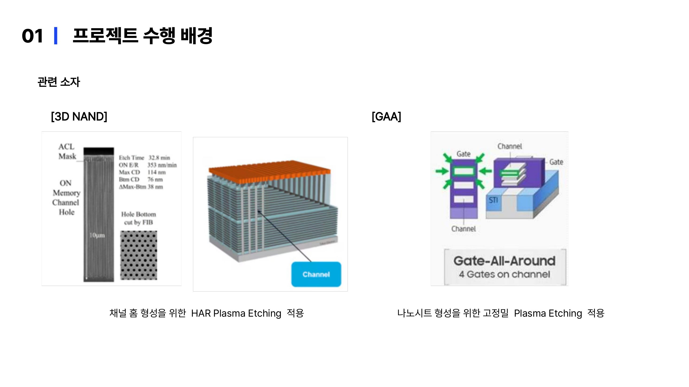
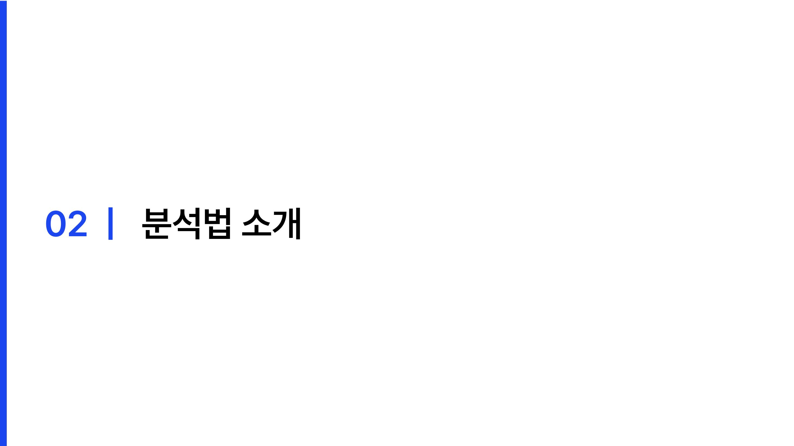

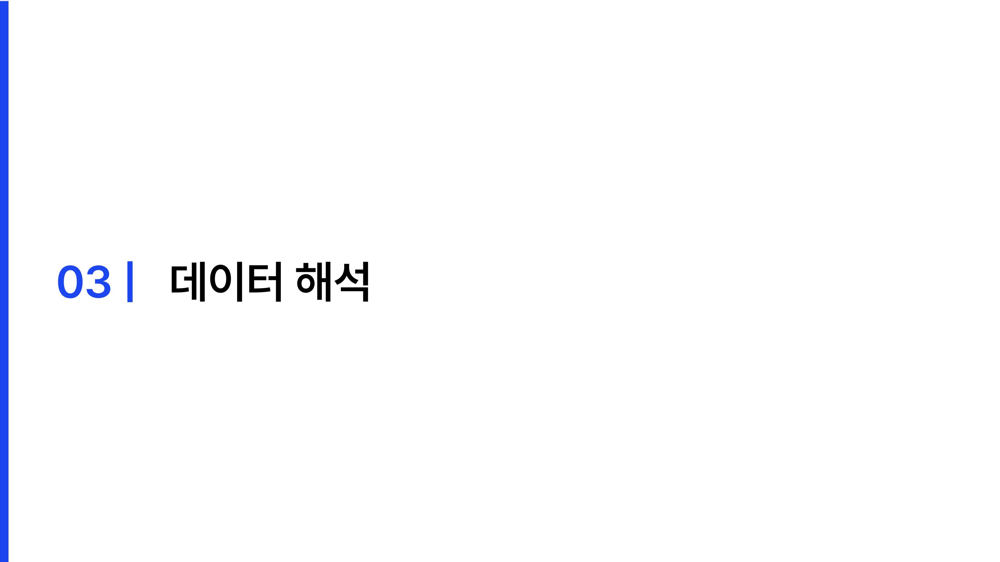

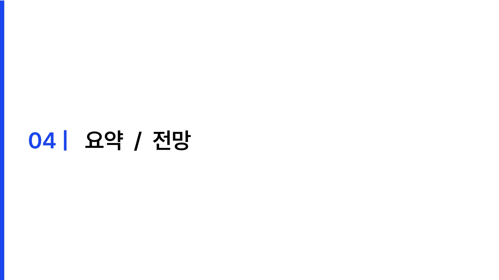

