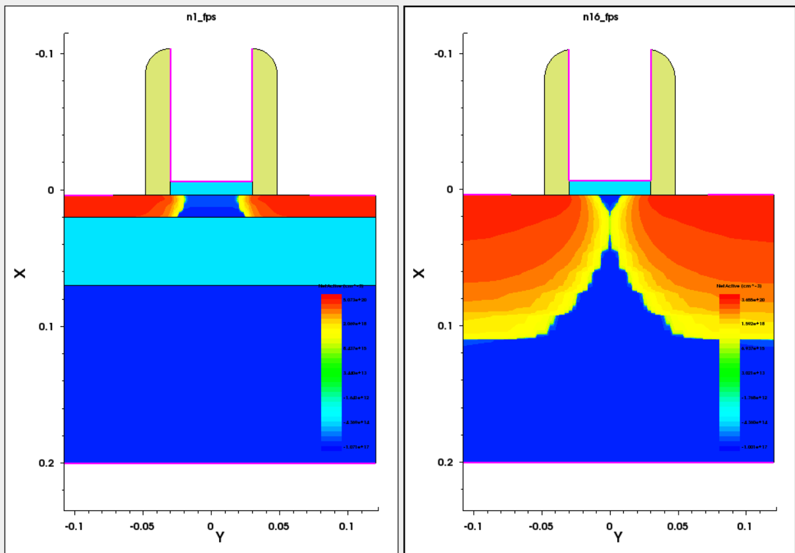
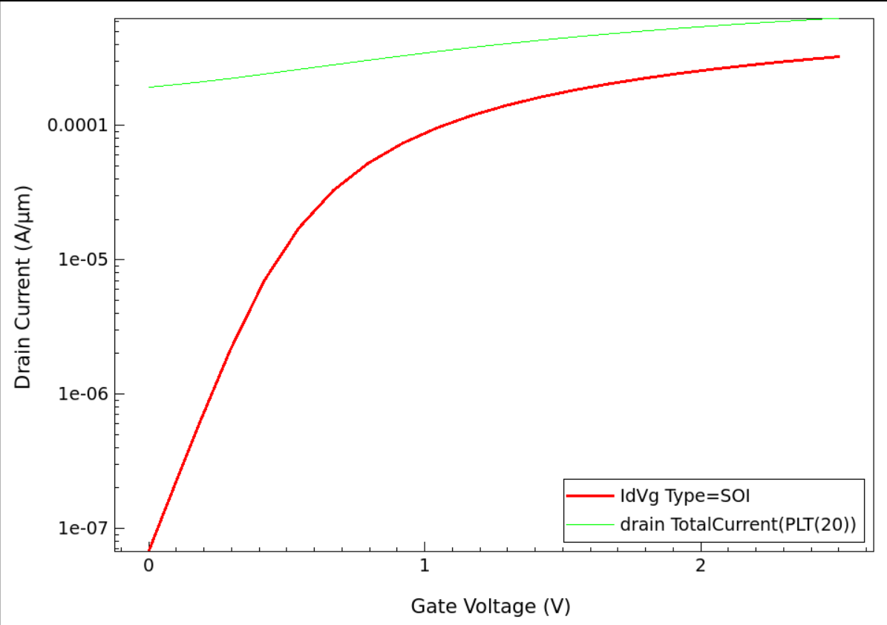
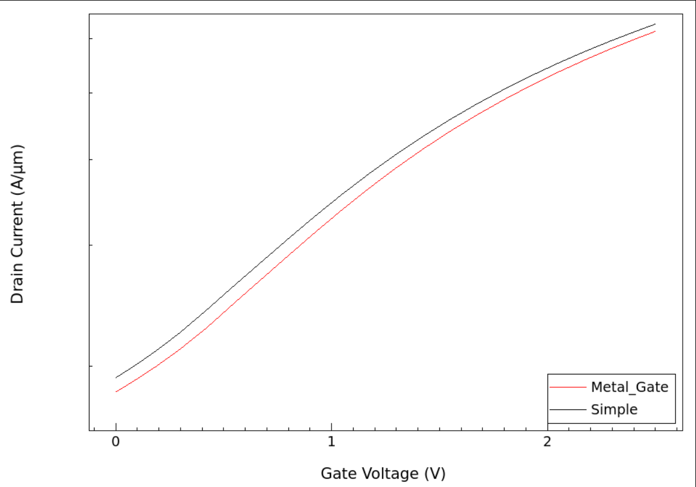
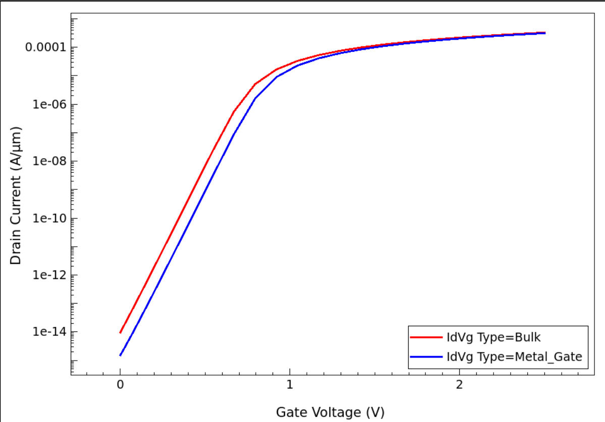
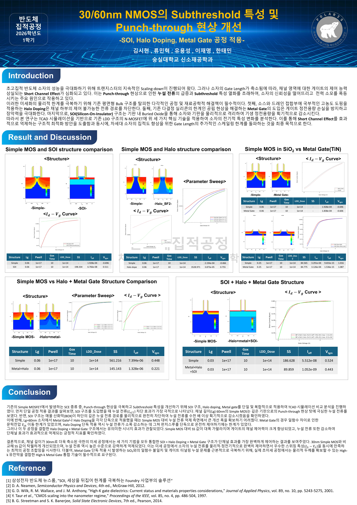

# 30/60nm NMOS의 Short Channel Effect 개선 — SOI · Halo Doping · Metal Gate

**Topic:** TCAD 시뮬레이션으로 소자 미세화에 따른 단채널 효과(SCE)와 Punch-through를 억제하는 공정 조합 탐색
**Course:** 반도체집적공정 (팀 프로젝트, 5인 — 김시현, 류민혁, 유용성, 이재명, 한태민)
**Period:** 2026.05–2026.06
**Tools:** Synopsys Sentaurus (Workbench, SProcess, SDevice, SVisual)
**Role:** SOI · Metal Gate · Halo Doping 시뮬레이션 담당 (팀 내 유일한 차세대반도체공학 복수전공자로서 TCAD 파트 수행)
**Keywords:** Short Channel Effect, Punch-through, SS, SOI, Halo Doping, Metal Gate, DIBL

[← 포트폴리오 홈으로](../)

---

## 1. 문제 정의 (Problem Definition)

게이트 길이(Lg)를 60nm, 30nm까지 축소하면 기존 평면형 벌크 MOSFET은 게이트의 채널 지배력이 약해져 **단채널 효과(SCE)** 가 발생한다. 특히 소스·드레인 공핍층이 기판 깊은 곳에서 맞닿는 **Punch-through**는 게이트 전압과 무관하게 대량의 누설 전류를 흐르게 해 스위치 기능 자체를 상실시킨다.

본 프로젝트의 목표는 LDD 기반 N-MOSFET에 **SOI, Halo Doping, Metal Gate** 세 공정을 단독/복합 적용하여, 각 기술의 효용성을 정량 비교하고 30nm급 미세 소자에서 SCE를 제어할 최적 공정 조합을 도출하는 것이다.

---

## 2. 배경 이론 (Background Theory)

### 평가 지표: Subthreshold Swing (SS)

SS는 드레인 전류를 10배 늘리는 데 필요한 게이트 전압으로, 작을수록 온/오프 전환이 가파르다. 상온에서의 물리적 한계는 약 60 mV/dec이며, SCE가 심해지면 SS가 급격히 상승해 Ioff가 폭증한다.

### 세 가지 개선 공정의 원리

| 공정 | 원리 | 기대 효과 |
|---|---|---|
| **SOI** (Silicon-On-Insulator) | 기판 내부에 매몰 산화막(BOX)을 형성해 기판 깊은 곳의 누설 경로를 물리적으로 차단 | Punch-through 원천 봉쇄, 접합 정전용량 감소 |
| **Halo Doping** | 소스/드레인 접합부 가장자리에 국부적 고농도 p형 도핑(NMOS 기준)을 경사 주입 | 공핍층 확장 억제, Vth roll-off 보상 |
| **Metal Gate** (TiN) | Poly-Si 게이트의 공핍 현상을 제거해 게이트 축전 용량 확보 | 게이트 지배력 회복 |

기존 LDD 구조는 60nm 이하에서 저농도 영역 자체가 공핍화되어 기판 깊은 곳으로 우회하는 Punch-through 경로를 막지 못한다는 한계가 있다.

---

## 3. 설계 / 분석 접근 (Design & Analysis Approach)

1. Lg = 60nm Simple MOS를 기준(baseline)으로 SCE 발생 확인
2. SOI, Halo Doping, Metal Gate를 **각각 단독 적용**하여 개별 효과 정량화
3. 효과가 제한적인 기술은 **복합 적용**(Halo + Metal Gate)으로 시너지 확인
4. Lg = 30nm에서 **세 기술 통합 구조**(SOI + Halo + Metal Gate)로 최종 검증

이 중 SOI, Metal Gate, Halo Doping 시뮬레이션을 직접 담당했다.

---

## 4. 진행 과정 (Process) — 담당 시뮬레이션

### 4-1. SOI 구조 (Lg = 60nm)

Simple MOS는 60nm에서 기판 방향 Punch-through가 발생해 게이트 제어력을 상실했다. 동일 조건에 SOI를 적용하자 BOX가 하부 누설 경로를 물리적으로 차단했다. (Vd = 0.1 V 기준)

| 구조 | Lg (µm) | SS (mV/dec) | Ioff (A) | Vtgm (V) |
|---|---|---|---|---|
| Simple | 0.06 | — (측정 불가 수준) | 1.928 × 10⁻⁴ | −0.696 |
| **SOI** | 0.06 | 198.334 | **6.766 × 10⁻⁸** | +0.511 |

Ioff가 **수천 배 감소**했고, Vtgm이 음수(항상 켜진 상태)에서 양수로 회복되어 소자가 다시 스위치로 동작하게 되었다.

### 4-2. Metal Gate 단독 적용 (TiN, 일함수 4.7 eV)

**60nm에서는 효과가 없었다.** Simple MOS에 Metal Gate만 추가한 경우 Ioff가 1.928 × 10⁻⁴ → 1.838 × 10⁻⁴ A로 사실상 변화가 없어, 이미 Punch-through가 발생한 소자에서는 게이트 재료 교체만으로 SCE를 잡을 수 없음을 확인했다.

SCE가 없는 Lg = 0.25 µm 조건에서 재검증한 결과, SS·gm은 큰 차이가 없으나 Ioff는 개선됨을 확인했다.

| 구조 | Lg (µm) | SS (mV/dec) | Ioff (A) | Vtgm (V) |
|---|---|---|---|---|
| Simple | 0.25 | 84.565 | 9.655 × 10⁻¹⁵ | 1.016 |
| **Metal Gate** | 0.25 | 84.775 | **1.536 × 10⁻¹⁵** | 1.087 |

### 4-3. Halo Doping

Halo 도핑 시뮬레이션에서는 조건 설정 과정 자체가 시행착오의 연속이었다.

1. 초기에는 LDD·Halo 조합으로 Punch-through가 잡히지 않아, **소스/드레인 도펀트를 Phosphorus에서 확산이 느린 Arsenic으로 변경**했다.
2. 그러자 벌크(기준 소자)에서도 SCE가 억제되어 Halo 효과의 **비교 자체가 불가능**해지는 문제가 발생했다.
3. 이에 Halo Dose를 통상적인 1e13~1e15 수준에서 **1e12~5e12로 낮춰 스윕**하여, 기준 소자와의 차이가 드러나는 조건에서 Halo의 효과를 분리 관찰했다.

단독 적용 결과(Lg = 60nm), Halo Doping은 누설 전류를 2.194 × 10⁻⁴ → 3.873 × 10⁻⁵ A로 소폭 감소시키고 Vtgm을 −0.466 → +0.755 V로 회복시켰으나, Punch-through를 단독으로 온전히 제어하기에는 한계가 있었다.

이 과정은 비교 실험에서 개선 효과만큼이나 **기준(baseline)의 설정이 중요하다**는 것을 체감한 경험이었다.

---

## 5. 결과 비교 (Results)

팀 전체 결과를 종합한 최종 비교표. (기판 도핑 PWell 1e17, GoxTime 10, LDD Dose 1e14 동일 조건)

| 소자 구조 | Lg (µm) | SS (mV/dec) | Ioff (A) | Vth (V) |
|---|---|---|---|---|
| Simple MOS | 0.06 | 561.216 | 7.394 × 10⁻⁶ | 0.448 |
| **Metal + Halo** | 0.06 | **145.143** | 1.328 × 10⁻⁶ | 0.221 |
| Simple MOS | 0.03 | 186.628 | 5.512 × 10⁻⁸ | 0.524 |
| **Metal + Halo + SOI** | 0.03 | **89.859** | **1.052 × 10⁻⁹** | 0.443 |

- **60nm**: 단독 적용 시 제한적이던 Halo와 Metal Gate가 복합 적용에서 시너지를 내며 SS 561 → 145 mV/dec로 대폭 개선
- **30nm**: 세 기술 통합 시 SS 89.9 mV/dec로 상온 이론 한계(60 mV/dec)에 근접, Ioff는 약 1/50로 감소

---

## 6. 해석 (Interpretation)

각 기술의 성격이 뚜렷하게 갈렸다. **SOI는 물리적 차단**이라 단독으로도 Punch-through에 즉효였지만, **Halo와 Metal Gate는 정전기적 보완**이라 단독으로는 한계가 있고 병합될 때 소자 내부의 정전기적 밸런스를 회복시키는 시너지를 냈다.

특히 Metal Gate 단독 시뮬레이션에서 60nm 소자의 개선이 사실상 없었던 결과는, 실제 산업에서 Metal Gate를 단독으로 쓰지 않고 **High-k 유전체와 결합한 HKMG(High-k Metal Gate)** 로 도입하는 이유를 데이터로 체감하게 해주었다. 게이트 재료만 바꿔서는 게이트 지배력 회복에 한계가 있고, 유효 산화막 두께(EOT)를 줄이는 High-k가 함께여야 정전기적 제어력이 실질적으로 회복된다.

---

## 7. 한계와 개선점 & 협업 회고 (Limitations & Retrospective)

**기술적 한계**

- Metal Gate의 일함수를 TiN의 대표값(4.7 eV) 하나로 고정했다. 일함수 스윕을 통해 Vth 조정 가능 범위를 확인하면 더 완성도 높은 분석이 됐을 것이다.
- High-k 유전체를 적용하지 못해 HKMG 통합 구조의 효과는 검증하지 못했다. 향후 EOT 관점의 후속 시뮬레이션이 필요하다.
- Halo Doping 파트는 조건 재설계에 시간이 소요되어 저농도 스윕 결과의 체계적 정리가 부족했다.

**협업에서 배운 것**

- 팀 내 유일한 차세대반도체공학 복수전공자로서 TCAD 시뮬레이션을 사실상 전담했다. 부담이 컸지만 SOI·Halo·Metal Gate 세 공정의 시뮬레이션을 독립적으로 설계·수행하며 가장 많이 성장한 파트이기도 했다. 동시에, 시뮬레이션이 중심인 과제일수록 **팀원 간 기술 격차를 줄이는 지식 공유가 초반에 필요하다**는 것을 배웠다.
- 결과 공유 과정에서 **변경한 변수에 대한 기록 없이 결과 수치만 공유되는 경우**가 있었고, 이는 최종 결과의 재현성과 신뢰성을 떨어뜨렸다. 다음 협업에서는 시뮬레이션 조건 기록 양식(변수, 값, 날짜, 담당자)을 먼저 합의하고 시작하는 것이 결과물의 품질을 좌우한다는 것을 체감했다.

---

## 발표 포스터

프로젝트 결과를 정리한 최종 포스터. (반도체집적공정 2026학년도 1학기)

