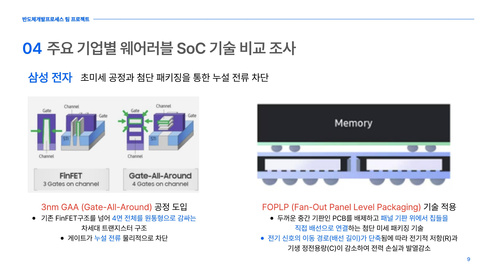
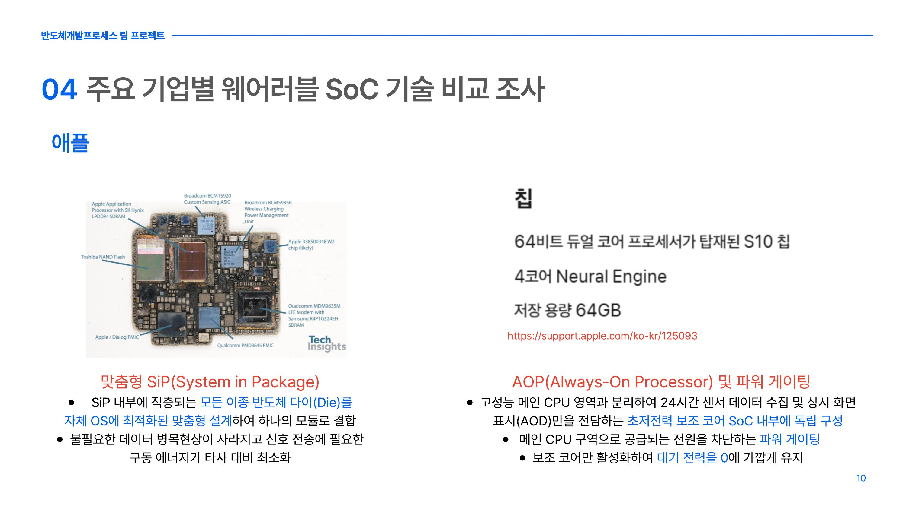
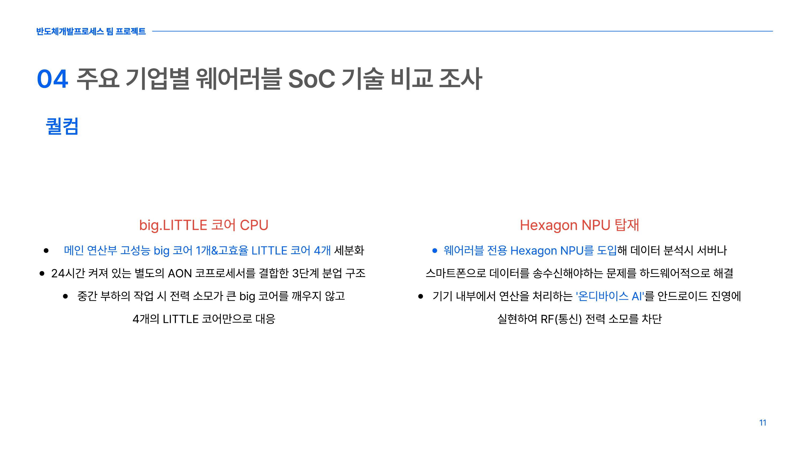
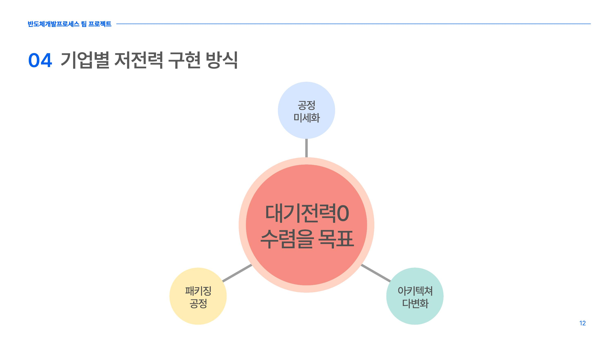
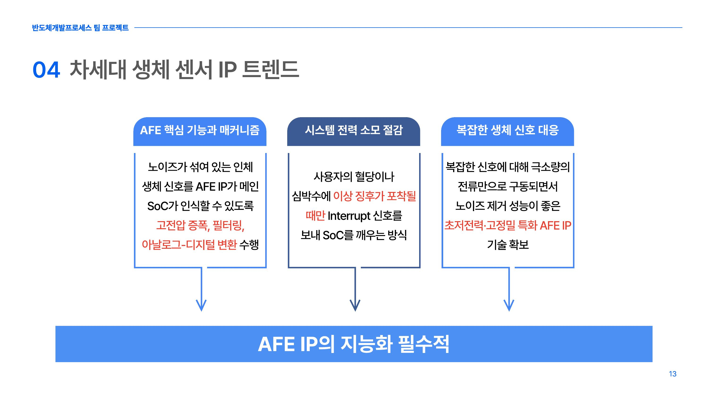

# 웨어러블 헬스케어용 초저전력 SoC — 기업별 저전력 기술 비교 (팀 프로젝트)

**Course:** 반도체 개발 프로세스 (팀 프로젝트, 5조)
**Period:** 2026.04–2026.06
**Role:** **"4. 주요 기업별 웨어러블 SoC 기술 비교 및 분류 조사" 파트 자료조사 및 발표 담당**
**Tools/Keywords:** 웨어러블 SoC, 초저전력 설계, GAA, FOPLP, SiP, big.LITTLE, NPU, Power Gating, 센서 IP

[← 포트폴리오 홈으로](../)

> 이 페이지는 팀 프로젝트 전체 주제를 간략히 소개한 뒤, 직접 자료조사하고 발표를 담당한 **4번 파트(기업별 웨어러블 SoC 저전력 기술 비교)** 를 중심으로 정리한다.

---

## 1. 프로젝트 개요

'질병의 사후 치료'에서 '일상적인 사전 예방·관리'로 의료 패러다임이 이동하면서, 심박수·수면·산소포화도 등을 상시 모니터링하는 웨어러블 헬스케어 기기의 중요성이 커지고 있다. 이 기기의 성능과 효율을 결정짓는 핵심은 반도체이며, 그중에서도 제한된 배터리 용량과 초소형 폼팩터를 극복하기 위한 **초저전력 설계**가 가장 강력한 설계 제약으로 작용한다.

본 팀 프로젝트는 이 문제의식에서 출발해 웨어러블 헬스케어용 **시스템 온 칩(SoC)** 과 **센서 IP** 기술을 분석했다. 전체 구성은 (1) 주제 선정 배경과 시장 동향, (2) 웨어러블 SoC의 정의와 저전력 달성 원리, (3) SoC 내 주요 센서 IP, (4) 주요 기업별 웨어러블 SoC 기술 비교, (5) SoC와 신소재공학의 연관성으로 이루어졌다.

이 중 **"4. 주요 기업별 웨어러블 SoC 기술 비교 및 분류 조사" 파트의 자료조사와 발표를 전담**했다. 삼성전자·애플·퀄컴이 각기 다른 출발점에서 어떻게 저전력을 구현하는지를 비교·분류하는 것이 이 파트의 목표였다.

---

## 2. 담당 파트 — 주요 기업별 웨어러블 SoC 저전력 기술 비교

웨어러블 SoC 시장을 주도하는 기업들은 배터리 용량의 물리적 한계를 극복하기 위해, 각자의 기술적 강점을 살린 독자적인 하드웨어 아키텍처를 채택하고 있다. 세 기업의 전략을 아래와 같이 비교·분류했다.

| 기업 | 대표 제품 | 핵심 전략 | 저전력 구현 방식 |
|---|---|---|---|
| **삼성전자** | Exynos W1000 | 소자 구조 혁신 | 3nm GAA 공정 + FOPLP 패키징 |
| **애플** | Apple S10 SiP | 설계·OS 통합 | 맞춤형 SiP + AOP·Power Gating |
| **퀄컴** | Snapdragon Wear Elite | 아키텍처 다변화 | big.LITTLE 3단계 분업 + Hexagon NPU |

### 2-1. 삼성전자 — 초미세 공정과 첨단 패키징으로 누설 전류 차단

설계(System LSI)와 위탁 생산(Foundry)을 모두 내재화한 종합 반도체 기업의 강점을 살려, 소자 자체의 물리적 구조 혁신으로 전력 손실을 줄인다. **3nm GAA(Gate-All-Around)** 는 채널의 4면을 원통형으로 완전히 감싸 게이트가 누설 전류를 물리적으로 차단하므로, 구동 전압을 낮춰도 안정적으로 동작해 전력 효율을 극대화한다. 또한 **FOPLP(Fan-Out Panel Level Packaging)** 로 두꺼운 PCB를 배제하고 배선 길이를 단축해, 저항(R)과 기생 정전용량(C)을 줄여 신호 전송 손실과 발열을 낮춘다.

### 2-2. 애플 — 자체 OS·설계 통합으로 전력 효율 극한 추구

자체 파운드리 대신, 독자 운영체제(watchOS)와 자체 칩 설계(Apple Silicon)를 결합해 한정된 공간의 전력 효율을 끌어올린다. **맞춤형 SiP(System in Package)** 는 AP·PMIC·통신 모듈 등 내부의 모든 이종 다이를 기성품이 아닌 자체 OS에 최적화된 형태로 직접 설계·결합한다. 하드웨어와 소프트웨어가 완벽히 동기화되어 데이터 병목이 줄고 구동 에너지가 최소화된다. 여기에 고성능 메인 CPU와 분리된 **AOP(Always-On Processor)** 를 두어, 대기 시 메인 CPU 전원을 **Power Gating** 으로 완전히 차단하고 보조 코어만 켜 대기 전력을 0에 가깝게 유지한다.

### 2-3. 퀄컴 — 아키텍처 다변화로 전력 사각지대 제거

칩을 '메인과 보조' 두 단계로만 나누는 방식을 넘어, 부하량에 따라 전력을 3단계 이상으로 세밀하게 변속한다. **big.LITTLE 코어** 는 메인 연산부를 고성능 big 코어 1개와 고효율 LITTLE 코어 4개로 세분화하고, 여기에 24시간 켜진 별도 AON 코프로세서를 결합한 3단계 분업 구조다. 중간 부하 작업에서는 big 코어를 깨우지 않고 LITTLE 코어만으로 대응해 전력 낭비의 사각지대를 없앤다. 또한 웨어러블 전용 **Hexagon NPU** 를 도입해, 클라우드·스마트폰과의 통신 없이 기기 내부에서 AI 연산을 처리하는 온디바이스 AI를 안드로이드 진영에 구현함으로써 RF(통신) 전력 소모를 크게 줄였다.

### 2-4. 비교의 시사점 — 서로 다른 출발점, 하나의 수렴점

세 기업은 공정 미세화, 패키징 공정, 아키텍처 다변화라는 각기 다른 출발점을 갖지만, 최종적으로는 **대기 전력을 0에 가깝게 만드는 것** 으로 수렴한다. 공통된 핵심 메커니즘은 두 가지다. 하나는 고성능 연산 블록과 초저전력 상시 구동 블록의 전력 공급 경로를 물리적으로 분리하는 **다중 전력 도메인** 설계이고, 다른 하나는 소프트웨어를 거치지 않고 칩 내부의 전용 하드웨어(AOP·AON)가 부하를 직접 판별해 전원을 차단하는 **하드웨어 기반 Power Gating** 이다. 즉 웨어러블 반도체의 전력 효율은 메인 프로세서의 최대 속도가 아니라, 대기 상태에서 얼마나 정밀하게 전원을 켜고 끄는지에 좌우된다.

### 2-5. 차세대 생체 센서 IP 트렌드

SoC를 통한 디지털 논리 회로의 저전력화가 성숙 단계에 접어들면서, 기술 경쟁력은 인체 신호 수집의 최전선인 **아날로그 프론트엔드(AFE) IP의 지능화** 로 이동하고 있다. 차세대 AFE IP는 하드웨어에 문턱 전압 비교기를 내장해, 혈당·심박수에 이상 징후가 포착될 때만 Interrupt로 SoC를 깨우는 방식(Smart Wake-up)으로 시스템 부하를 줄인다. 나아가 땀 성분·비침습 혈당 같은 복잡한 생체 신호를 극소량의 전류(nA)로 처리하면서도 노이즈 제거 성능이 뛰어난 초저전력·고정밀 특화 AFE IP 확보가 차세대 시장의 핵심이 될 것으로 분석했다.

---

## 3. 발표 자료 (담당 파트)

아래는 직접 조사·발표한 4번 파트의 발표 슬라이드다.

---

## 4. 느낀점 (Retrospective)

이 프로젝트의 핵심은 서로 다른 기업이 저전력을 달성하기 위해 적용한 기술들을 **같은 기준 위에서 비교·분류** 한 데 있었다. 단순히 각 사의 기술을 나열하는 데 그치지 않고, 소자 구조(삼성)·설계 통합(애플)·아키텍처 분업(퀄컴)이라는 서로 다른 출발점이 결국 '대기 전력 0 수렴'이라는 하나의 목표로 모인다는 구조를 세우는 것이 조사의 방향이었다.

발표 후 질의응답에서 교수님께서 **"기업별 기술을 구체적으로 어떻게 비교했는가"** 를 물으셨다. 이에 대해 각 회사의 **최신 웨어러블 기기(스마트워치)의 공개 스펙을 확인하고, 관련 기술 아티클을 근거로 대조하는 방식으로 비교했다** 고 답변했다. 제품이라는 구체적 결과물의 실제 사양에서 출발해 그 배경 기술을 문헌으로 뒷받침하는 접근이었기에, 비교의 근거를 명확히 제시할 수 있었다.

이 과정에서 기술 비교란 대상을 많이 아는 것보다 **비교의 축(공통 기준)을 어떻게 설정하느냐** 가 설득력을 좌우한다는 점을 체감했다. 또한 여러 기업의 이질적인 전략을 하나의 논리로 수렴시켜 발표로 전달하는 경험은, 조사한 내용을 청중이 이해할 수 있는 구조로 재구성하는 훈련이 되었다.
