# TCAD PMOS Process Conversion & Optimization

**Topic:** Sentaurus TCAD SimpleMOS(nMOS) 예제의 pMOS 공정 변환 및 소자 특성 최적화
**Period:** 2026.04–2026.05
**Course:** 반도체집적공정 (개인 프로젝트)
**Tools:** Synopsys Sentaurus (Workbench, SProcess, SDevice, SVisual)
**Keywords:** pMOS, Ion/Ioff, SS, Vth, NWell doping, LDD dose, DIBL

---

## 1. 문제 정의 (Problem Definition)

Sentaurus TCAD의 SimpleMOS 예제는 nMOS 기준으로 작성되어 있다. 본 프로젝트의 목표는 두 가지다.

1. SimpleMOS의 공정 흐름을 수정하여 **pMOS 소자로 변환**한다.
2. 공정 변수(NWell 도핑 농도, LDD Dose)를 조정하여 다음 조건을 만족하는 **최적의 pMOS**를 도출한다.
   - Vth < 0 (pMOS 동작 조건)
   - Ioff 최소화 (대기 전력 절감)
   - Imax 최대화 (커패시터 충전 속도, 즉 동작 속도 확보)
   - SS(Subthreshold Swing) 최소화 (스위칭 효율)

핵심 과제는 서로 상충하는 지표들(Imax ↑ vs Ioff ↓) 사이에서 균형점을 찾는 것이다.

---

## 2. 배경 이론 (Background Theory)

### nMOS와 pMOS의 차이

nMOS는 캐리어가 전자, pMOS는 정공이다. 정공은 전자보다 무거워 이동도가 낮다. 이에 따라 도핑 구조가 반대가 된다.

| 구분 | nMOS | pMOS |
|---|---|---|
| 기판(Well) | P-type — Boron | N-type — Phosphorus |
| Source/Drain & LDD | N-type — Phosphorus/Arsenic | P-type — Boron (LDD는 BF₂) |

### 왜 LDD에 Boron 대신 BF₂를 쓰는가

트랜지스터가 미세화되면 핫 캐리어에 의한 소자 손상을 막기 위해 표면에 얕은 LDD를 형성해야 한다. 그런데 Boron(질량수 11)은 너무 가벼워 주입 시 웨이퍼 깊숙이 들어간다. 그래서 F 2개를 붙인 **BF₂(질량수 49)** 를 주입한다. 20 keV로 BF₂를 주입하면 질량비에 따라 B이 받는 에너지는 약 4.5 keV에 불과해 얕은 접합이 형성되고, F는 이후 열처리에서 제거된다.

### 평가 지표

- **Vth**: Well 농도가 높을수록 게이트가 채널을 반전시키기 어려워져 Vth의 절댓값이 커진다.
- **Ioff**: OFF 상태에서 Source→Drain 누설 전류. 대기 전력을 결정한다.
- **Imax**: ON 상태 최대 구동 전류. 클수록 소자가 빠르다.
- **SS**: 전류를 10배 변화시키는 데 필요한 게이트 전압. 작을수록 스위칭이 가파르고 Ioff 억제에 유리하다. Log-scale transfer curve에서 subthreshold 구간의 기울기로 나타난다.

---

## 3. 설계 / 분석 접근 (Design & Analysis Approach)

### 공정 변환 (SProcess 수정)

| 항목 | 기존 (nMOS) | 수정 (pMOS) | 근거 |
|---|---|---|---|
| Well | PWell, Boron | **NWell, Phosphorus** | 기판 극성 반전 |
| LDD | Arsenic(75), 30 keV | **BF₂(49), 20 keV** | 얕은 접합 형성, Boron 확산 보상 |
| Source/Drain | Phosphorus, 15 keV | **Boron, 6 keV** | Boron은 가벼워 확산이 빠르므로 저에너지 주입 |

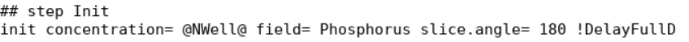
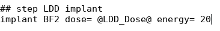
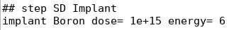

### 최적화 전략 (DOE)

1. SVisual 스크립트를 추가해 Ioff, Imax, Vtgm, SS, gm을 자동 추출
2. **NWell 농도 스윕** → Vth와 Ioff/Imax 균형점 탐색
3. 선정된 NWell 조건에서 **LDD Dose 스윕** → SS 및 Ioff 개선
4. 교차 검증(NWell 재스윕)으로 최적 조합 확정

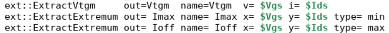

---

## 4. 진행 과정 (Process)

### 4-1. pMOS 공정 시뮬레이션

웨이퍼 생성 → 산화막 형성 → Poly-Si 증착 → 게이트 패터닝/식각 → LDD 임플란트 → Spacer 형성/식각 → S/D 임플란트 → Annealing → Al 전극 형성/식각 순으로 진행했다.

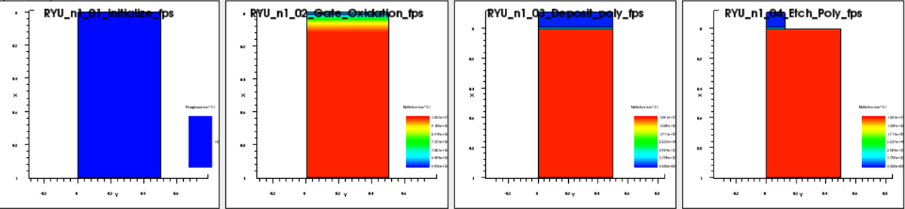
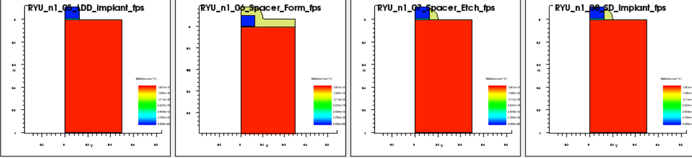
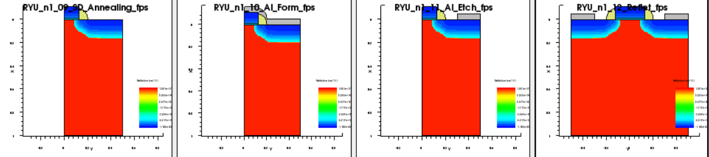

Annealing 이전에는 LDD와 S/D 주입 영역이 Net Active로 드러나지 않다가, Annealing 후 활성화되는 것을 확인했다. 최종 구조의 Net Active / Phosphorus / Boron 분포로 기판에는 Phosphorus, 게이트·소스·드레인에는 Boron이 도핑된 pMOS가 완성되었음을 검증했다.

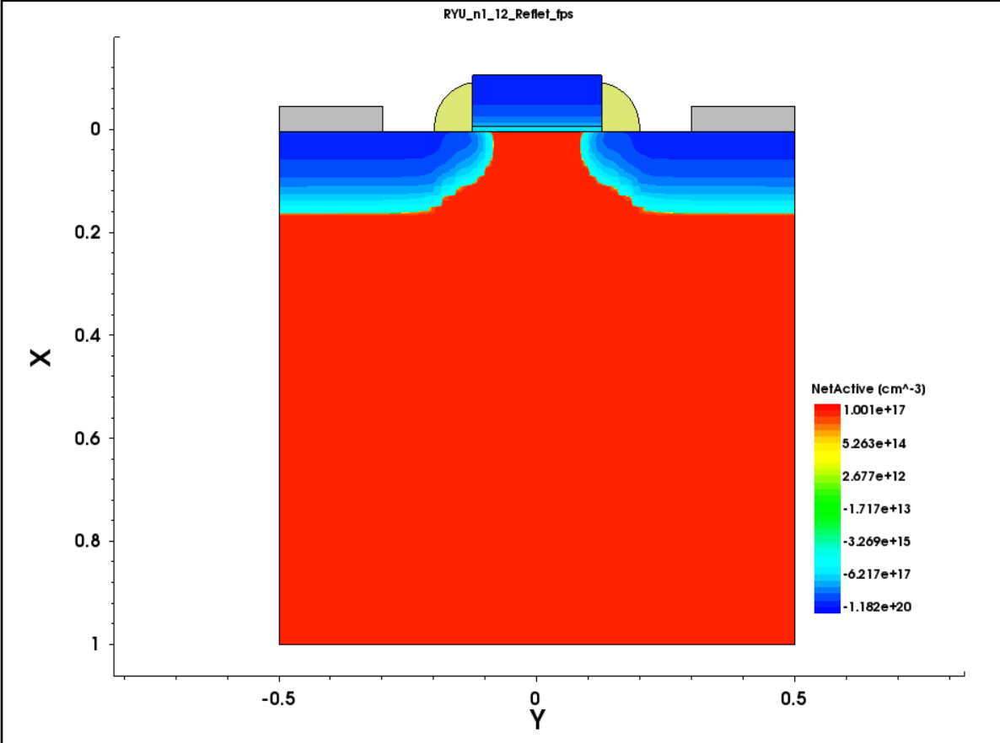

### 4-2. Vd 조건에 따른 특성 확인

Vd를 −0.05 V에서 −1.0 V로 높이면 **DIBL**(Drain-Induced Barrier Lowering)로 인해 Ioff가 크게 증가했다. 한편 추출된 Vtgm의 절댓값은 오히려 증가했는데, 이는 높은 Vd에서 속도 포화·이동도 저하로 gm이 감소하면서 외삽 기반 Vtgm 추출의 X절편이 밀려나는 **측정상의 아티팩트**로 해석된다.

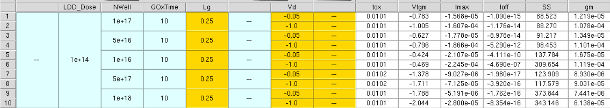

### 4-3. NWell 농도 최적화

기준 1e17을 중심으로 0.1×~10× 스윕 후, 유망 구간(1e17~5e17) 사이 2e17, 3e17, 4e17을 추가 계산했다.

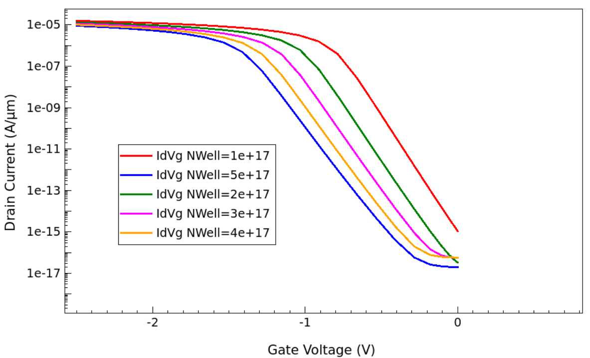

3e17~5e17은 Ioff 차단은 우수하지만 Imax가 크게 감소 → **1e17, 2e17을 후보로 선정**.

### 4-4. LDD Dose 최적화

LDD 농도를 높이면 저항이 줄어 Imax는 증가하지만, Annealing 중 Boron의 측면 확산(lateral diffusion)이 심해져 채널을 침범, Ioff가 급증한다. 기준 1e14에서 1e13~1e15 스윕 결과 **1e13이 최적**: Ioff가 가장 낮고 subthreshold 기울기가 가장 가파르면서, Imax 손실은 최대 조건 대비 미미했다.

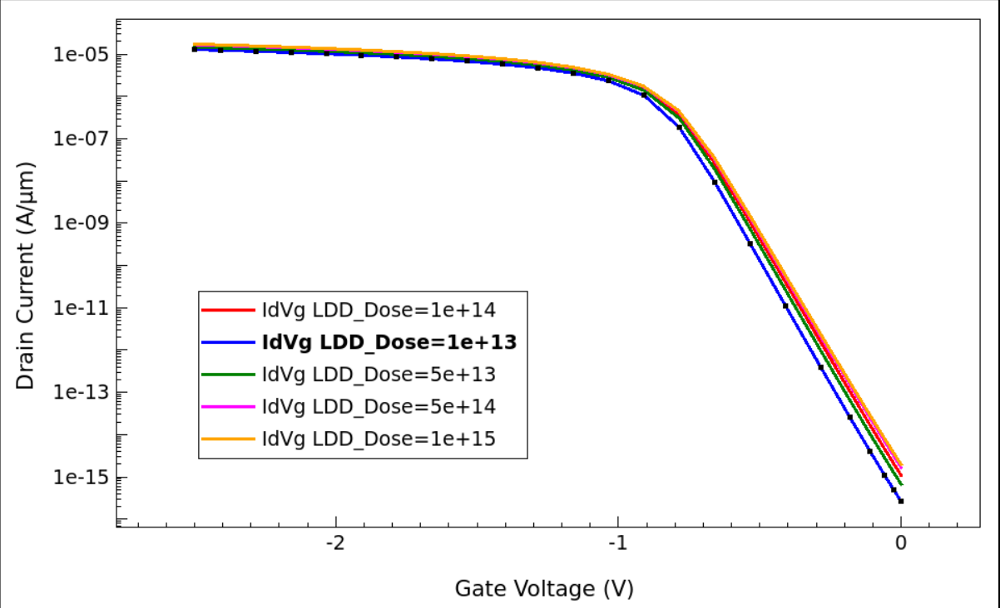

추가로 1e13 이하(5e12~1e11)까지 낮춰 검증한 결과, Ioff는 더 줄었으나 LDD 영역 캐리어 부족으로 저항이 커져 Imax가 눈에 띄게 감소 → 1e13 유지.

### 4-5. 교차 검증

LDD = 1e13 조건에서 NWell을 2e16, 4e16까지 낮춰 재확인 → Ioff 격차가 크고 Imax 이득은 작아 **1e17, 2e17이 여전히 우세**함을 확인.

---

## 5. 결과 비교 (Results)

### 최종 최적 조건 수치

**NWell = 1e17 cm⁻³, LDD Dose = 1e13 cm⁻²** 의 SVisual 추출값. (pMOS이므로 I, V는 음수 → 크기로 표기)

| 항목 | Vd = −0.05 V (Linear 영역) | Vd = −1.0 V (Saturation, 실동작) |
|---|---|---|
| Vtgm (V) | −0.812 | −1.065 |
| Imax (A/µm) | 1.292 × 10⁻⁵ | 1.390 × 10⁻⁴ |
| Ioff (A/µm) | 2.645 × 10⁻¹⁵ | 1.111 × 10⁻¹⁵ |
| SS (mV/dec) | 86.6 | 84.2 |
| gm (S) | 1.044 × 10⁻⁵ | 9.721 × 10⁻⁵ |

Vth < 0으로 pMOS 동작 조건을 만족하고, Ioff는 10⁻¹⁵ A/µm 수준으로 매우 낮으며 SS도 84~87 mV/dec로 이상적(60 mV/dec)에 근접했다.

### 최적화 전후 비교 (실동작 Vd = −1.0 V 기준)

LDD Dose를 기준값 1e14에서 **1e13으로 낮춘** 효과. NWell은 1e17로 동일.

| 지표 | 최적화 전 (LDD 1e14) | 최적화 후 (LDD 1e13) | 변화 |
|---|---|---|---|
| Ioff (A/µm) | 1.176 × 10⁻¹⁴ | 1.111 × 10⁻¹⁵ | **≈ 91% 감소** ✅ |
| Imax (A/µm) | 1.607 × 10⁻⁴ | 1.390 × 10⁻⁴ | 약 13.5% 감소 |
| SS (mV/dec) | 88.3 | 84.2 | **4.1 개선** ✅ |

핵심 결과는 **Imax는 약 13.5%만 희생하면서 누설 전류 Ioff를 약 91% 줄이고 SS까지 개선**한 것이다. 즉 미미한 구동 전류 손실로 대기 전력과 스위칭 효율을 크게 개선한, 균형 잡힌 최적화다.

### 최종 후보 NWell 1e17 vs 2e17 비교 (LDD 1e13 고정)

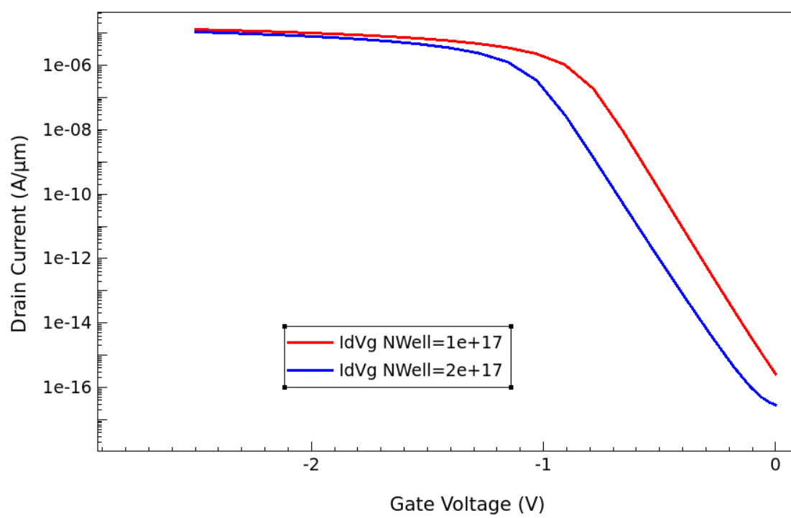

| 조건 | Ioff @ −1.0V (A/µm) | Imax @ −1.0V (A/µm) | 판단 |
|---|---|---|---|
| NWell 2e17 | 2.185 × 10⁻¹⁶ (더 낮음) | 1.081 × 10⁻⁴ (불순물 산란↑ → 이동도↓) | 탈락 |
| **NWell 1e17** | 1.111 × 10⁻¹⁵ (이미 충분히 낮음) | **1.390 × 10⁻⁴ (더 큼)** | **최종 선정** |

2e17은 Ioff가 더 낮지만 그 이득이 실익이 없을 만큼 1e17도 이미 충분히 낮고, 대신 Imax는 1e17이 약 29% 크다. 따라서 **NWell = 1e17이 최적**.

### 그래프 스케일 활용

| 스케일 | 용도 |
|---|---|
| Linear | Imax, Vth 확인에 유리 |
| Log | Ioff, SS(기울기) 확인에 유리 |

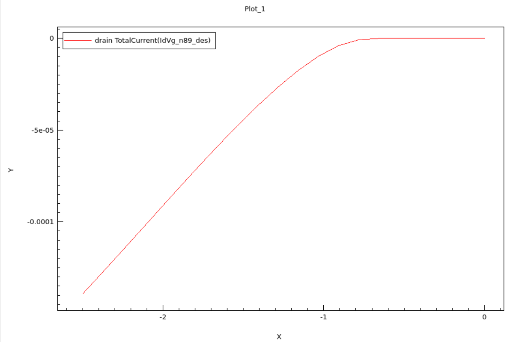
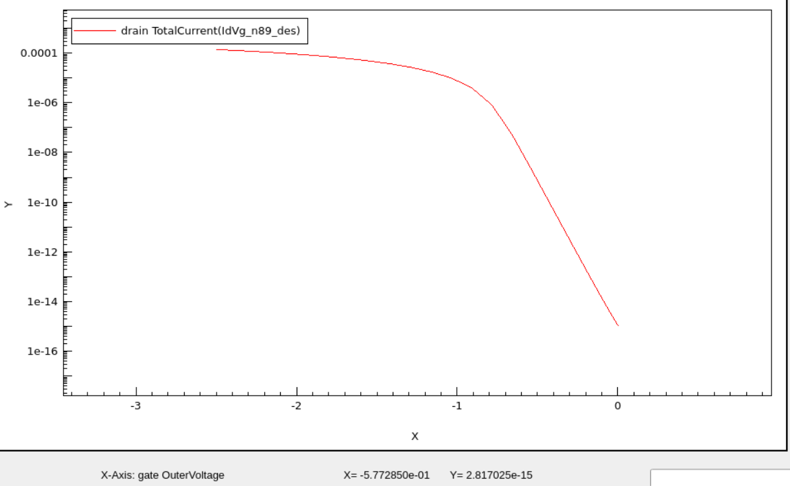

---

## 6. 해석 (Interpretation)

이번 최적화의 본질은 **"모든 것을 가질 수는 없다"** 는 반도체 설계 원칙의 체득이다. Imax를 키우면 Ioff가 늘고, Ioff를 줄이면 속도가 느려진다. 최적점은 절대적인 것이 아니라 **용도가 결정**한다.

**고성능(HP) 설계 — CPU/GPU/서버:**
- NWell 농도 ↓ → 이동도 확보, Vth 절댓값 ↓, Imax 극대화
- LDD Dose ↑ → 기생 저항 감소 (단, SCE에 취약)
- Gate Oxide ↓ → 게이트 지배력 강화

**저전력(LP) 설계 — 모바일/IoT:**
- NWell 농도 ↑ → Vth 절댓값 ↑, Ioff 억제
- LDD Dose ↓ + Spacer 두께 ↑ → 측면 확산 차단, SS 개선

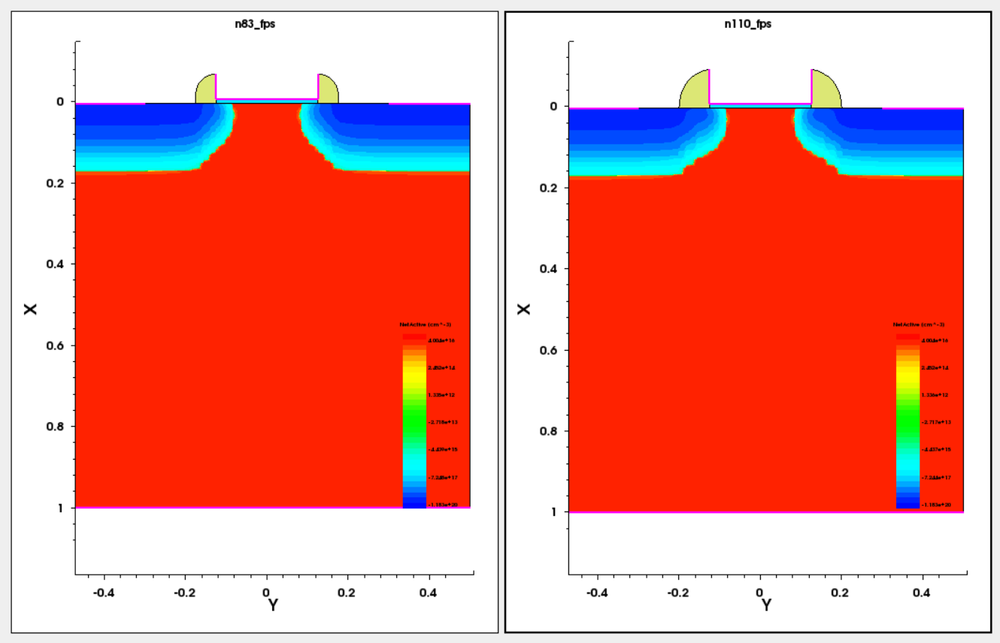

상수로 고정돼 있던 Spacer 두께를 변수로 전환하여, LP 설계 방향의 추가 최적화 여지도 확인했다.

---

## 7. 한계와 개선점 (Limitations & Future Work)

- **탐색 변수의 제한**: NWell, LDD Dose 2개 변수 중심으로 최적화했다. Gate Oxide 두께, Spacer 두께, RTA 온도/시간, Halo implant 등으로 설계 공간을 확장하면 더 정밀한 최적점을 찾을 수 있다.
- **수동 그리드 탐색**: 조건을 수동으로 추가하며 탐색했다. DOE 기법이나 Ion/Ioff–SS 산점도 기반의 다목적 최적화를 도입하면 더 체계적인 비교가 가능하다.
- **단일 Vd 중심 비교**: 경향 분석은 주로 Vd = −0.05 V에서 수행했다. 실동작 전압(−1.0 V)에서의 DIBL 영향을 포함한 종합 평가가 필요하다.
- **Vtgm 추출 방식의 한계**: 외삽법 기반 추출은 고전압에서 아티팩트가 발생함을 확인했다. Constant-current 방식 등 대안적 Vth 추출법과의 교차 검증이 유효할 것이다.
